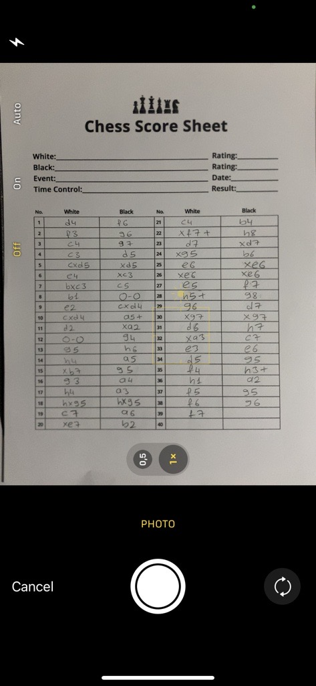
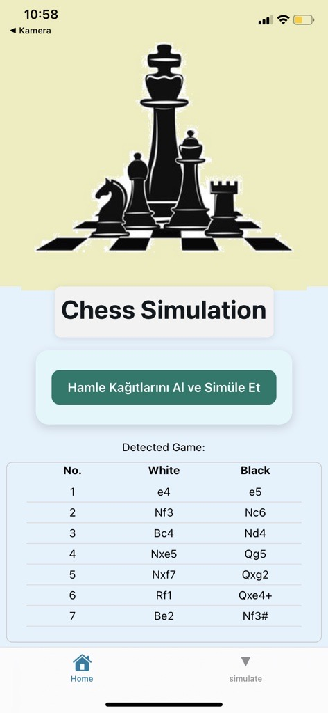
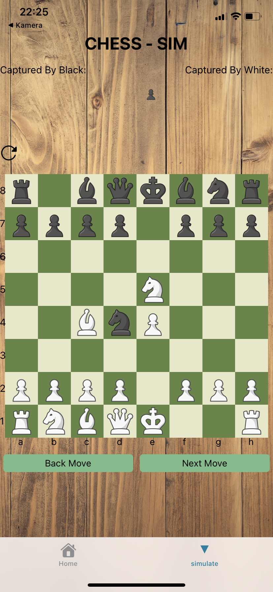

# ChessSim — AI-Powered Chess Score Sheet Digitizer

> A senior thesis project from Kocaeli University, Computer Engineering Department.
> Built by **Samet Bilek** & **Çağrı Uçaroğlu** · Advisor: Assoc. Prof. Dr. Orhan Akbulut · 2025

ChessSim eliminates the last truly analog bottleneck in competitive chess: the handwritten score sheet. At the end of a tournament game, a referee no longer manually transcribes 40–80 moves into a computer — a player simply photographs both score sheets, and the system delivers a validated PGN file in under four seconds.

The pipeline runs two custom-trained deep learning models back to back. The first model (YOLOv8) locates every move cell on the sheet with surgical precision. The second model (a custom CNN) reads the handwritten chess notation inside each cell and assembles it into a legal move sequence. A React Native mobile app ties the experience together, culminating in a step-by-step board simulation with check and checkmate detection.

---

## Project Overview

| Score Sheet Capture | Move Detection Result | Board Simulation |
|:---:|:---:|:---:|
|  |  |  |
| The user photographs the handwritten score sheet directly from the mobile app. | The AI pipeline extracts and recognises every move, presenting them in a structured two-column table. | Validated moves are replayed step by step on an interactive board with check highlighting and captured piece tracking. |

---

## Technologies

| Category | Technology |
|---|---|
| Language | Python 3 · TypeScript |
| Mobile | React Native 0.79 + Expo 53 · Expo Router |
| Chess Engine | chess.js 1.2 |
| Object Detection | YOLOv8n (Ultralytics) — custom trained |
| OCR / Recognition | Custom CNN (Conv2D × 3 → GAP → FC → Softmax) — trained from scratch |
| Image Processing | OpenCV · Pillow · NumPy |
| Backend API | FastAPI |
| Training Environment | Google Colab (Tesla T4 GPU, CUDA) |
| Dataset Management | Roboflow |
| State Management | React Context API |
| Animation | React Native Reanimated |

---

## Architecture Overview

```
📸  Camera (React Native / Expo)
        │
        │  POST multipart/form-data
        ▼
🐍  FastAPI  /analyze-chess
        │
        ├─ 1. Cell Detection  ──────────────────────────────────────
        │     YOLOv8n (custom)
        │     Input : 640 × 640 image
        │     Output: bounding boxes [x, y, w, h, conf] × N cells
        │     Sort  : left-column → right-column, top → bottom
        │
        ├─ 2. Character Recognition ────────────────────────────────
        │     Custom CNN (50+ chess notation classes)
        │     Input : 80 × 80 grayscale cell crop
        │     Output: predicted move string  (e.g. "Nf3", "O-O", "+")
        │     Post  : chess-rule-aware correction pass
        │
        └─ 3. PGN Assembly
              Pair white/black moves → validate → emit JSON + PGN
                      │
                      ▼
📱  Simulate Tab (chess.js)
        ├─ FEN updates per half-move
        ├─ Captured pieces tracker
        ├─ Check / checkmate detection + visual highlight
        └─ Step-by-step board replay
```

---

## Features

### Custom-Trained Cell Detection Model

> The first problem to solve was locating move cells on a score sheet — a task no off-the-shelf model was trained for. 35+ real score sheet images were hand-labeled in Roboflow, each cell annotated as a single bounding box. YOLOv8n was then trained for 50 epochs on a 640 × 640 normalized dataset with random crop, flip, grayscale, and blur augmentations.
>
> The result is a single-class detector that achieves **mAP@0.5 of 93.6 %** and runs inference in **22 ms per image**. After detection, cells are sorted geometrically — split into two columns by x-centroid threshold, then ordered by y-coordinate within each column — reconstructing the natural reading order of the notation sheet.

### Custom-Trained Handwriting Recognition Model

> Reading handwritten chess notation is a qualitatively different problem from printed OCR. Characters like `b` and `6`, or `1` and `l`, are routinely confused. Symbols like `O-O` (castling) and `+` (check) appear nowhere in standard OCR training sets.
>
> A CNN was designed and trained from scratch on ~8 000 individually labeled cell crops:

```
Input [1 × 80 × 80]
  └─ Conv2D(32) + BatchNorm + ReLU + MaxPool
  └─ Conv2D(64) + BatchNorm + ReLU + MaxPool
  └─ Conv2D(128) + BatchNorm + ReLU + MaxPool
  └─ Global Average Pooling
  └─ Dropout(p=0.3)
  └─ Fully Connected(512) + ReLU
  └─ Fully Connected(50) + Softmax
```

> The 50-class output covers the complete algebraic notation alphabet: piece letters (`N B Q K R`), files (`a–h`), ranks (`1–8`), and symbols (`+ # × O-O =`). A post-processing pass applies chess-rule constraints to fix remaining ambiguities, bringing full-cell prediction accuracy to **89.5 %** and average character accuracy to **96.8 %**.

### End-to-End PGN Pipeline

> Recognised move strings are paired (white move + black move), validated against PGN structure, and emitted as both a JSON array and a `.pgn`-compatible text file. The entire pipeline — from the moment the shutter fires to the moment the PGN lands in the app — takes an average of **3.4 seconds** on a standard LAN connection.

### Interactive Board Simulation

> The mobile app receives the move list and feeds it into chess.js, which validates each half-move and computes the resulting FEN string. The user can step forward and backward through every move with haptic feedback. Illegal moves are flagged on-screen. When the king enters check, both the checked square and the attacking piece square are highlighted in red via a dedicated React Context. Checkmate and stalemate are announced as soon as they are detected.

### Cross-Platform Mobile App

> Built with React Native + Expo Router, the app runs identically on Android and iOS without platform-specific branches. The home screen collects player names and triggers the photo capture flow; the simulate screen renders the live board. All network configuration is environment-variable-driven so the backend URL can be swapped without a rebuild.

---

## Model Performance at a Glance

### Cell Detection — YOLOv8n

| Metric | Value |
|---|---|
| Precision | 92.3 % |
| Recall | 90.7 % |
| mAP@0.5 | **93.6 %** |
| Inference time (single image) | 22 ms |
| Training epochs | 50 |
| Training images | 35+ labeled score sheets |

### Character Recognition — Custom CNN

| Metric | Value |
|---|---|
| Training accuracy | 98.1 % |
| Validation accuracy | 95.4 % |
| Test accuracy | **94.2 %** |
| Avg. character-level accuracy | 96.8 % |
| Avg. full-cell prediction rate | 89.5 % |
| Training samples | ~8 000 cell crops |
| Classes | 50+ |

### End-to-End System (60 real score sheets, 30 players)

| Metric | Value |
|---|---|
| Cell detection success rate | 94.7 % |
| Character recognition accuracy | 91.3 % |
| PGN accuracy per match | 86.5 % |
| Error-free PGN generation rate | 76.2 % |
| Image to PGN latency | **3.4 s avg** |

---

## The Process

### Problem definition and baseline research

> Tournament referees manually transcribe handwritten score sheets into digital systems after every game — a slow, error-prone process that bottlenecks post-game analysis and archiving. Classic OCR engines (Tesseract et al.) fail on handwritten chess notation because the character set mixes piece abbreviations, algebraic coordinates, and symbols that differ across national conventions. The decision was made early to train domain-specific models rather than adapt a general solution.

### Dataset construction and annotation (YOLOv8)

> Real score sheets were collected from local chess clubs. Each sheet was photographed under varied lighting and angles to build robustness from the start. Annotation was done in Roboflow with bounding boxes around every move cell. After augmentation the effective training set grew substantially; the single-class YOLO configuration kept the detection head focused and avoided class imbalance issues.

### YOLOv8 cell detection — training and iteration

> YOLOv8n was chosen over larger variants to keep inference fast enough for a mobile workflow. Early runs revealed that cells near the sheet margins were clipped by aggressive random crops; augmentation parameters were tuned to fix this. The geometric cell-sorting algorithm was developed in parallel: because the notation table always has two columns, a simple x-centroid split reliably separates them, and per-column y-sorting reconstructs reading order.

### OCR dataset construction and model design

> Individual cell crops from the YOLO runs were manually labeled with their ground-truth move strings — the most labour-intensive phase of the project. Special attention was paid to underrepresented classes (`O-O`, `O-O-O`, `#`) and ambiguous pairs (`b/6`, `1/l`). The CNN architecture was designed with the 80 × 80 grayscale input in mind: three convolutional blocks with batch normalisation and max-pooling extract spatial features; global average pooling flattens the feature map without a dense explosion; a moderate dropout rate prevents overfitting on the relatively small dataset.

### Post-processing and chess-rule correction

> Raw CNN outputs for a cell can occasionally produce strings that are not legal chess notation (e.g. `"N13"` instead of `"Nf3"`). A rule-based correction pass substitutes common OCR confusions guided by positional context in the move sequence, significantly reducing downstream PGN errors without requiring any additional training data.

### API design and mobile integration

> The FastAPI backend exposes a single endpoint (`POST /analyze-chess`) that accepts a multipart image, runs the full pipeline, and returns a JSON move array. The React Native app posts the image over the local network and renders the result immediately. Temporary files (uploaded images, extracted cell crops, YOLO run artefacts) are cleaned up after each request so the server stays stateless.

### Board simulation and game-state management

> chess.js handles all move validation and FEN computation, so the simulation layer never needs to implement chess rules itself. A React Context broadcasts the checked king's square and the attacking piece's square to the board renderer, which applies conditional red styling. The captured pieces display is derived from FEN diffs between consecutive half-moves.

---

## What I Learned

- **Domain-specific model training outperforms general OCR by a wide margin** —
  Tesseract failed almost completely on handwritten chess notation, while a custom CNN trained on ~8 000 domain-specific samples reached 94 % test accuracy. For narrow, well-defined recognition tasks, a small purpose-built model beats a large general one every time.

- **Data quality trumps data quantity** —
  the YOLO model reached mAP@0.5 > 93 % on just 35 labeled images. Carefully augmented, high-quality annotations and a well-matched architecture mattered far more than raw scale.

- **Geometric post-processing is a first-class pipeline component** —
  sorting detected bounding boxes into the correct reading order required explicit spatial reasoning (two-column split + per-column y-ordering). This step is invisible when it works and catastrophic when it fails; designing it carefully early saved many debugging hours.

- **CNN architecture depth is a real trade-off** —
  early experiments with deeper networks overfit badly on the limited character dataset. Settling on three convolutional blocks with aggressive batch normalisation and dropout was the right call; validation accuracy tracked training accuracy closely throughout.

- **Post-processing is not a patch — it is a system layer** —
  the chess-rule correction pass was initially dismissed as a hack. In practice it improved end-to-end PGN accuracy meaningfully, because it exploits domain knowledge that the pure ML model cannot learn from image data alone.

- **Mobile-to-server latency requires tight pipeline discipline** —
  the 3.4-second round-trip is acceptable, but achieving it required removing every unnecessary disk write and subprocess call from the hot path. Profiling the FastAPI handler revealed that file cleanup was the biggest latency contributor; batching deletions shaved meaningful time off the critical path.

- **chess.js as a truth layer** —
  delegating all move legality and game-state logic to a battle-tested library kept the simulation code simple and allowed the frontend to trust its own state completely. Any move that chess.js rejects is surfaced to the user immediately with clear feedback.

- **Handwriting is harder than it looks** —
  the `b/6` and `1/l` ambiguity cannot be resolved from a single cell in isolation. Context (e.g. the character appears in file position → must be a letter) is necessary. This reinforced why post-processing rules and move-sequence context matter even after a high-accuracy model.

---

## How Can It Be Improved

- **Sequence-aware recognition with CRNN + CTC** —
  the current CNN classifies each cell as a whole unit. Replacing it with a CRNN (CNN + BiLSTM + CTC decoder) would allow variable-length move strings to be decoded character-by-character, eliminating the fixed-length assumption and improving accuracy on unusual multi-character moves.

- **Perspective correction as a preprocessing step** —
  players rarely photograph score sheets perfectly flat. An automated homography estimation step (four-corner detection + projective warp) would normalise the input geometry before YOLO runs, reducing detection errors on skewed or angled images.

- **Larger, crowd-sourced handwriting dataset** —
  8 000 samples covers the core character distribution but underrepresents rare symbols and individual handwriting extremes. A crowd-sourcing campaign at a regional tournament could collect thousands of additional labeled cells in a single day.

- **Lichess / Chess.com PGN export** —
  the PGN produced by the system is structurally valid, but adding standard headers (`[Event]`, `[White]`, `[Black]`, `[Date]`) and a one-tap "Open in Lichess" deep link would make the output immediately usable by players for post-game analysis.

- **Editable PGN correction view** —
  when the model makes a mistake, the user currently has no way to fix individual moves in-app. An editable move list that revalidates and re-renders the board on every change would complete the loop between AI output and human oversight.

- **Confidence thresholding with selective human review** —
  the OCR model outputs a softmax distribution; cells where the top prediction probability falls below a threshold could be flagged for manual correction rather than silently passed through, trading a small amount of user effort for a significant accuracy improvement.

- **On-device inference with Core ML / TFLite** —
  offloading YOLO and the CNN to the device would eliminate the LAN dependency entirely, making the system usable in venues without reliable Wi-Fi — exactly the environment where large-scale tournaments are held.

- **Real-time tournament integration** —
  in the long run the pipeline could feed directly into tournament management software (e.g. Swiss-Manager or FIDE's official tools), publishing PGN files automatically the moment a game ends and enabling live broadcast analysis.

---

## Running the Project

### Prerequisites

- [Node.js 18+](https://nodejs.org/)
- [Python 3.9+](https://www.python.org/)
- [Expo CLI](https://docs.expo.dev/get-started/installation/)
- YOLOv8 model weights at `yolo_project/runs/detect/train6/weights/best.pt`

```bash
npm install -g expo-cli
```

### 1. Start the Python backend

```bash
cd yolo_project
pip install fastapi uvicorn ultralytics opencv-python pillow numpy python-multipart
uvicorn main:app --host 0.0.0.0 --port 9999
```

### 2. Configure the API endpoint

Open `.env` in the project root and set the IP address of the machine running the backend:

```env
API_URL=http://<YOUR_LOCAL_IP>:9999
```

> Both devices must be on the same network. Find your machine's local IP with `ipconfig` (Windows) or `ifconfig` (macOS / Linux).

### 3. Start the mobile app

```bash
npm install
npx expo start
```

Scan the QR code with Expo Go (Android / iOS), or press `a` for Android emulator / `i` for iOS simulator.

### 4. Use the app

1. Open the app and enter the white player's name.
2. Tap **Capture & Simulate** and photograph white's score sheet.
3. Enter the black player's name and photograph black's score sheet.
4. The move list appears automatically — tap **Simulate** to replay the game move by move on the board.
